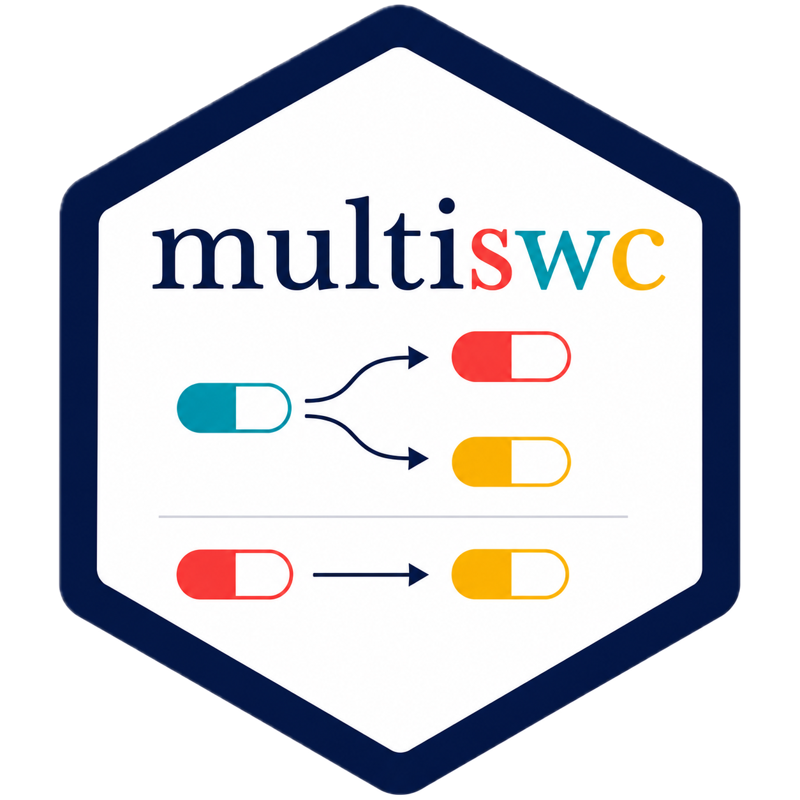

# `multiswc`: Multi-regime marginal structural model for clinical trials analytics with treatment switching

<div align="center">

</div>

Estimate the causal effect of sustained treatment strategies on overall survival in clinical trials with possible treatment crossover and switch to subsequent therapy. Simulate faithful longitudinal clinical trials data with survival endpoints and multi-way treatment switches allowing for time-dependent prognostic factors.

---

## Installation

Install the develop version of `multiswc` package on GitHub. CRAN version is forthcoming.

```r
remotes::install_github("tonyhbc/multiswc")
library(surviv)
```

---
